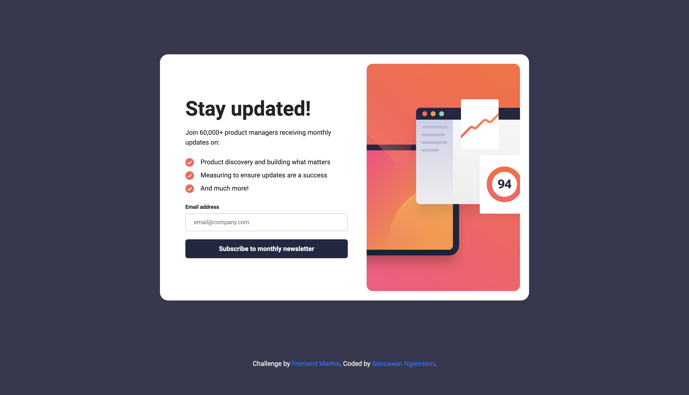

# Frontend Mentor - Newsletter sign-up form with success message solution

This is a solution to the [Newsletter sign-up form with success message challenge on Frontend Mentor](https://www.frontendmentor.io/challenges/newsletter-signup-form-with-success-message-3FC1AZbNrv). Frontend Mentor challenges help you improve your coding skills by building realistic projects. 

## Table of contents

- [Frontend Mentor - Newsletter sign-up form with success message solution](#frontend-mentor---newsletter-sign-up-form-with-success-message-solution)
  - [Table of contents](#table-of-contents)
  - [Overview](#overview)
    - [The challenge](#the-challenge)
    - [Screenshot](#screenshot)
    - [Links](#links)
  - [My process](#my-process)
    - [Built with](#built-with)
    - [What I learned](#what-i-learned)
    - [Continued development](#continued-development)
    - [Useful resources](#useful-resources)
  - [Author](#author)
  - [Acknowledgments](#acknowledgments)


## Overview
  It is a subscription design to receive news from the website. and the website can interact with users.

### The challenge

Users should be able to:

- Add their email and submit the form
- See a success message with their email after successfully submitting the form
- See form validation messages if:
  - The field is left empty
  - The email address is not formatted correctly
- View the optimal layout for the interface depending on their device's screen size
- See hover and focus states for all interactive elements on the page

### Screenshot




### Links

<!-- - Solution URL: [Add solution URL here](https://your-solution-url.com) -->
- Live Site URL: [Add live site URL here](https://newsletter-signup-form-with-success-m.netlify.app)

## My process
My workflow is divided into 3 steps.
  1. Design process
  2. Coding process
  3. Project verification process

### Built with

- Semantic HTML5 markup
- CSS custom properties
- Flexbox
- CSS Grid
- Mobile-first workflow
- Bootstrap
- JavaScript

### What I learned
First of all i learn a lot at the HTML Element and Attributes esspecially <input> element, I learn about spellcheck and onkeyup attributes and how they works.
```html
    <input type="email" name="Email" class="d-block w-100" id="emailInput" placeholder="email@company.com" spellcheck="false" onkeyup="validateEmail()" required />
```

Another thing that is learn is CSS property about background - linear-hradient, clamp and calc to use as value
```css
  background: linear-gradient(90deg, rgba(255,83,120,1) 0%, rgba(212,63,54,1) 57%, rgba(255,104,66,1) 100%);
  font-size: clamp(3.1rem, 0.5rem + 1.1vw, 3.8rem);
  padding-left:  calc(15px + ((50vw - 768px) / 10));
```

JavaScript is my newthing that i have learn first function is form validation, Second code is keep user input(email) to use to display another page as query. And the last is code to sent user back to the first page.
```js
  function validateEmail() {
      const emailCheck = document.getElementById('emailInput');
      const emailError = document.getElementById('emailError');

      if (!emailCheck.checkValidity()) {
          emailError.textContent = "Valid email required";
      } else {
          emailError.textContent = "";
      }
  }

  let uerEmail = document.getElementById('emailInput');
  let emailParams = new URLSearchParams(window.location.search);
  let email = emailParams.get('Email');
  let decodedEmail = decodeURIComponent(email);
  userEmail.textContent = decodedEmail;


  const Dismissing = document.getElementById('Dismissing');
  Dismissing.addEventListener('click', function() {
      window.location.href = 'index.html';
  });

```

### Continued development
I think taht i need to use React.js for next project and use Tailwind.css for style.


### Useful resources

- [Stackoverflow](https://stackoverflow.com) - They have many solution that can help my project.
- [Fontend Mentor Discord](https://discord.gg/VEPTuyVg) - This community can help you. please join and explore.

## Author

- Website - [Sonsawan Ngamsom](https://www.linkedin.com/in/murphy6867/)
- Frontend Mentor - [@murphy6867](https://www.frontendmentor.io/profile/murphy6867)
- Twitter - [@NgamsomSonsawan](https://twitter.com/NgamsomSonsawan)

## Acknowledgments

I would like to express my deepest gratitude to the team behind the Newsletter sign-up form with success message solution. This project wouldn't have been possible without the collective effort and dedication of everyone involved. Special thanks to the designers for creating an appealing and user-friendly form, the front-end developers for their expertise in HTML, CSS, and JavaScript, and the back-end developers for seamlessly handling the form submission process. Your hard work and collaboration have resulted in a successful and efficient solution. I am truly grateful for your commitment and contributions to this project.
